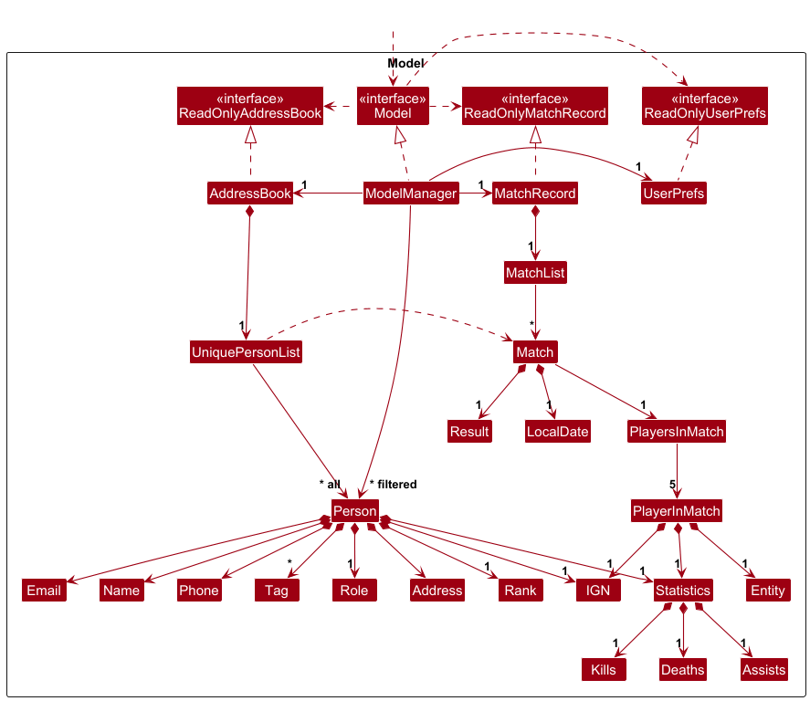
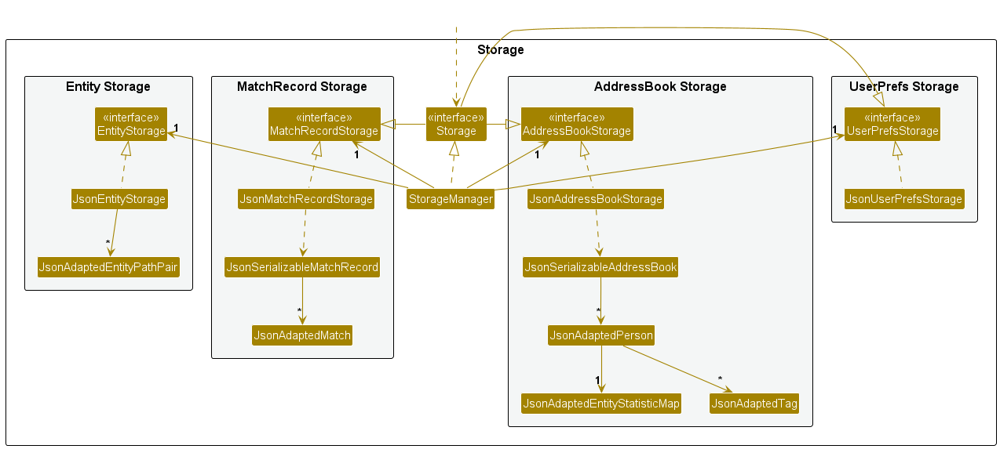

* Table of Contents
{:toc}

--------------------------------------------------------------------------------------------------------------------

## **Acknowledgements**

This project is adapted from AddressBook-Level3, which is made by the SE-EDU initiative.

* League of Legends is a game made by Riot Games. All images and other associated intellectual property belongs to them.
* Multiple AI tools were used for code autocompletion, bug finding and fixing, as well as ensuring the accuracy of documentation.
* The Help function code was reused from Jun Hung's IP.

Furthermore, the following third-party libraries/frameworks are used.
* JavaFX for GUI
* Jackson for JSON utilities
* JUnit 5 for testing

--------------------------------------------------------------------------------------------------------------------

## **Setting up, getting started**

Refer to the guide [_Setting up and getting started_](SettingUp.md).

--------------------------------------------------------------------------------------------------------------------

## **Design**

:bulb: **Tip:** The `.puml` files used to create diagrams are in this document `docs/diagrams` folder. Refer to the [_PlantUML Tutorial_ at se-edu/guides](https://se-education.org/guides/tutorials/plantUml.html) to learn how to create and edit diagrams.

### Architecture

The ***Architecture Diagram*** given above explains the high-level design of the App.

Given below is a quick overview of main components and how they interact with each other.

**Main components of the architecture**

**`Main`** (consisting of classes [`Main`](https://github.com/se-edu/addressbook-level3/tree/master/src/main/java/seedu/address/Main.java) and [`MainApp`](https://github.com/se-edu/addressbook-level3/tree/master/src/main/java/seedu/address/MainApp.java)) is in charge of the app launch and shut down.
* At app launch, it initializes the other components in the correct sequence, and connects them up with each other.
* At shut down, it shuts down the other components and invokes cleanup methods where necessary.

The bulk of the app's work is done by the following four components:

* [**`UI`**](#ui-component): The UI of the App.
* [**`Logic`**](#logic-component): The command executor.
* [**`Model`**](#model-component): Holds the data of the App in memory.
* [**`Storage`**](#storage-component): Reads data from, and writes data to, the hard disk.

[**`Commons`**](#common-classes) represents a collection of classes used by multiple other components.

**How the architecture components interact with each other**

The *Sequence Diagram* below shows how the components interact with each other for the scenario where the user issues the command `delete 1`.

Each of the four main components (also shown in the diagram above),

* defines its *API* in an `interface` with the same name as the Component.
* implements its functionality using a concrete `{Component Name}Manager` class (which follows the corresponding API `interface` mentioned in the previous point.

For example, the `Logic` component defines its API in the `Logic.java` interface and implements its functionality using the `LogicManager.java` class which follows the `Logic` interface. Other components interact with a given component through its interface rather than the concrete class (reason: to prevent outside component's being coupled to the implementation of a component), as illustrated in the (partial) class diagram below.

The sections below give more details of each component.

### UI component

The **API** of this component is specified in [`Ui.java`](https://github.com/se-edu/addressbook-level3/tree/master/src/main/java/seedu/address/ui/Ui.java)

The UI consists of a `MainWindow` that is made up of parts e.g.`CommandBox`, `ResultDisplay`, `PersonListPanel`, `StatusBarFooter` etc. All these, including the `MainWindow`, inherit from the abstract `UiPart` class which captures the commonalities between classes that represent parts of the visible GUI.

The `UI` component uses the JavaFx UI framework. The layout of these UI parts are defined in matching `.fxml` files that are in the `src/main/resources/view` folder. For example, the layout of the [`MainWindow`](https://github.com/se-edu/addressbook-level3/tree/master/src/main/java/seedu/address/ui/MainWindow.java) is specified in [`MainWindow.fxml`](https://github.com/se-edu/addressbook-level3/tree/master/src/main/resources/view/MainWindow.fxml)

The `UI` component,

* executes user commands using the `Logic` component.
* listens for changes to `Model` data so that the UI can be updated with the modified data.
* keeps a reference to the `Logic` component, because the `UI` relies on the `Logic` to execute commands.
* depends on some classes in the `Model` component, as it displays `Person` object residing in the `Model`.

### Logic component

**API** : [`Logic.java`](https://github.com/se-edu/addressbook-level3/tree/master/src/main/java/seedu/address/logic/Logic.java)

Here's a (partial) class diagram of the `Logic` component:

The sequence diagram below illustrates the interactions within the `Logic` component, taking `execute("delete 1")` API call as an example.

:information_source: **Note:** The lifeline for `DeleteCommandParser` should end at the destroy marker (X) but due to a limitation of PlantUML, the lifeline continues till the end of diagram.

How the `Logic` component works:

1. When `Logic` is called upon to execute a command, it is passed to an `AddressBookParser` object which in turn creates a parser that matches the command (e.g., `DeleteCommandParser`) and uses it to parse the command.
1. This results in a `Command` object (more precisely, an object of one of its subclasses e.g., `DeleteCommand`) which is executed by the `LogicManager`.
1. The command can communicate with the `Model` when it is executed (e.g. to delete a person). 
   Note that although this is shown as a single step in the diagram above (for simplicity), in the code it can take several interactions (between the command object and the `Model`) to achieve.
1. The result of the command execution is encapsulated as a `CommandResult` object which is returned back from `Logic`.

Here are the other classes in `Logic` (omitted from the class diagram above) that are used for parsing a user command:

How the parsing works:
* When called upon to parse a user command, the `AddressBookParser` class creates an `XYZCommandParser` (`XYZ` is a placeholder for the specific command name e.g., `AddCommandParser`) which uses the other classes shown above to parse the user command and create a `XYZCommand` object (e.g., `AddCommand`) which the `AddressBookParser` returns back as a `Command` object.
* All `XYZCommandParser` classes (e.g., `AddCommandParser`, `DeleteCommandParser`, ...) inherit from the `Parser` interface so that they can be treated similarly where possible e.g, during testing.

### Model component
**API** : [`Model.java`](https://github.com/se-edu/addressbook-level3/tree/master/src/main/java/seedu/address/model/Model.java)

The `Model` component,

* stores the address book data i.e., all `Person` objects (which are contained in a `UniquePersonList` object).
* stores the currently 'selected' `Person` objects (e.g., results of a search query) as a separate _filtered_ list which is exposed to outsiders as an unmodifiable `ObservableList<Person>` that can be 'observed' e.g. the UI can be bound to this list so that the UI automatically updates when the data in the list change.
* stores a `UserPref` object that represents the user’s preferences. This is exposed to the outside as a `ReadOnlyUserPref` objects.
* does not depend on any of the other three components (as the `Model` represents data entities of the domain, they should make sense on their own without depending on other components)

### Storage component

**API** : [`Storage.java`](https://github.com/se-edu/addressbook-level3/tree/master/src/main/java/seedu/address/storage/Storage.java)

The `Storage` component,
* can save both address book data and user preference data in JSON format, and read them back into corresponding objects.
* inherits from both `AddressBookStorage` and `UserPrefStorage`, which means it can be treated as either one (if only the functionality of only one is needed).
* depends on some classes in the `Model` component (because the `Storage` component's job is to save/retrieve objects that belong to the `Model`)

### Common classes

Classes used by multiple components are in the `seedu.address.commons` package.

--------------------------------------------------------------------------------------------------------------------

## **Adding new features**

### Adding a new command

To add a new command, here are two key things to note.

* Ensure your new command and it's associated parser is added to `CommandRegistry.java`
* Ensure your new command class has the public static variables `COMMAND_WORD`, `MESSAGE_USAGE`, `PARAMETERS`, and `EXAMPLE` are declared.

Doing so ensures that the app's HelpWindow will be automatically populated with your newly added command's information. Having the `COMMAND_WORD` declared also ensures that the new command will be added into the `AddressBookParser.java`, meaning your command will be usable! No need to modify any other files or switch cases.

--------------------------------------------------------------------------------------------------------------------

## **Documentation, logging, testing, configuration, dev-ops**

* [Documentation guide](Documentation.md)
* [Testing guide](Testing.md)
* [Logging guide](Logging.md)
* [Configuration guide](Configuration.md)
* [DevOps guide](DevOps.md)

--------------------------------------------------------------------------------------------------------------------

## **Appendix: Requirements**

### Product scope

**Target user profile**:

* has a need to manage a significant number of players and their player details, statistics, roles, and availability
* prefer desktop apps over other types
* can type fast
* prefers typing to mouse interactions
* is reasonably comfortable using CLI apps

**Value proposition**: manage team operations and analyze player data (statistics, roles, availability) faster and more efficiently than a typical mouse/GUI driven app

### User stories

Priorities: High (must have) - `* * *`, Medium (nice to have) - `* *`, Low (unlikely to have) - `*`

| Priority | As a …​                                    | I want to …​                     | So that I can…​                                                        |
| -------- | ------------------------------------------ | ------------------------------ | ---------------------------------------------------------------------- |
| `* * *`  | new user                                   | see usage instructions         | refer to instructions when I forget how to use the App                 |
| `* * *`  | user                                       | add a new player               | keep track of the team players                                         |
| `* * *`  | user                                       | delete a player                | remove players who have left the team                                  |
| `* * *`  | user                                       | edit a player's details        | update their stats, IGN, role, rank, or contact information            |
| `* * *`  | user                                       | list all players               | view all players in the team                                           |
| `* * *`  | user                                       | find a player by name          | locate details of players without having to go through the entire list |
| `* * *`  | user                                       | add match results              | update the stats of the team players and keep track of past matches    |
| `* * *`  | user                                       | compare two players            | see side-by-side comparisons of their statistics and attributes       |
| `* * *`  | user                                       | filter players by tags         | quickly find players with specific characteristics or categories        |
| `* * *`  | user                                       | filter players by roles        | find players who play specific roles in the game                       |
| `* * *`  | user                                       | filter players by entities     | find players who have statistics for specific characters/champions     |
| `* * *`  | team manager                               | draft a team                   | validate team composition with proper role distribution                 |
| `* * *`  | user                                       | update player statistics       | track and improve player performance over time                         |
| `* * *`  | user                                       | view detailed statistics       | see kill/death/assist data for specific entities                        |
| `* *`    | user                                       | view overall player statistics | see aggregated performance across all entities                         |

#### Yet to be implemented

| Priority | As a …​                                    | I want to …​                     | So that I can…​                                                        |
| `* * *`  | user                                       | view match history             | review past match results and player performance                       |
| `* *`    | data analyst                               | track performance trends       | identify players who are improving or declining over time              |
| `* *`    | team manager                               | identify best entity pickers   | know which players perform best on specific entities                   |
| `*`      | user                                       | import player data             | quickly populate the roster from external sources                       |
| `*`      | user                                       | export player data             | share team information with other coaches or platforms                 |
| `*`      | user                                       | archive old match data         | maintain clean records by moving historical data to archives           |

### Use cases

(For all use cases below, the **System** is the `DraftDeck` and the **Actor** is the `user`, unless specified otherwise)

**Use case: UC01 - Add a player**

  **Preconditions**

  * DraftDeck is running and ready to accept commands.

  **Guarantees**

  * The new player is added to DraftDeck with the specified details only if the given details are valid.
  * The new player is not added to DraftDeck if the given details are invalid.
  * Existing players remain unchanged.

  **MSS**

1.  User requests to add a player with name, phone, email, IGN, role, rank, and optional tags.
2.  DraftDeck adds the player to the roster.
3.  DraftDeck displays a success message and the details of the newly added player.

    Use case ends.

**Extensions**

* 1a. DraftDeck detects missing or invalid command format.

    * 1a1. DraftDeck displays an error message showing the correct command usage.

    Use case ends.

* 1b. DraftDeck detects an invalid parameter value (e.g., invalid phone format, invalid role).

    * 1b1. DraftDeck displays an error message specific to the invalid field.

    Use case ends.

* 1c. DraftDeck detects that a player with the same details already exists.

    * 1c1. DraftDeck displays an error message indicating the duplicate.

    Use case ends.

**Use case: UC02 - Delete a player**

  **Guarantees**

  * The specified player is deleted from DraftDeck if the index is valid.
  * No player is deleted if the index is invalid.
  * All other players remain unchanged, except for their index.

  **MSS**

1.  User lists all players (UC10).
2.  User requests to delete a specific player in the list by index.
3.  DraftDeck deletes the player.

    Use case ends.

**Extensions**

* 2a. The given index is invalid (not a positive integer or out of range).

    * 2a1. DraftDeck shows an error message.

    Use case resumes at step 1.

**Use case: UC03 - Filter players**

  **Guarantees**

  * Only players matching the specified filter criteria are displayed.
  * All players remain in the roster regardless of the filter.
  * No data is lost when applying filters.

  **MSS**

1.  User lists all players (UC10).
2.  User requests to filter players by tags, roles, entities, or any combination.
3.  DraftDeck shows a filtered list of players matching the specified criteria.

    Use case ends.

**Extensions**

* 2a. No players match the filter criteria.

    * 2a1. DraftDeck shows an empty list.

    Use case ends.

**Use case: UC04 - Compare two players**

**MSS**

1.  User lists all players (UC10).
2.  User requests to compare two specific players by their indices or IGNs.
3.  DraftDeck displays a side-by-side comparison of the selected players.

    Use case ends.

**Extensions**

* 2a. The given index is invalid (not a positive integer or out of range).

    * 2a1. DraftDeck shows an error message.

    Use case resumes at step 1.

* 2b. The given IGN is not found in the player list.

    * 2b1. DraftDeck shows an error message.

    Use case resumes at step 1.

* 2c. Both indices or both IGNs refer to the same player.

    * 2c1. DraftDeck shows an error message indicating that different players must be selected.

    Use case resumes at step 1.

**Use case: UC05 - Edit a player**

**MSS**

1. User lists all players (UC10).
2. User requests to edit a specific player in the list with one or more fields.
3. DraftDeck updates the player and shows a success message.

   Use case ends.

**Extensions**

* 2a. There are no fields to edit.

    * 2a1. DraftDeck displays an error message notifying the user that at least one field must be provided.

   Use case resumes at step 1.

* 2b. The given index is invalid (not a positive integer or out of range).

   * 2b1. DraftDeck displays an error message and shows the correct index range.

   Use case resumes at step 1.

* 2c. The edited player would be a duplicate of another player.

   * 2c1. DraftDeck displays an error message indicating the duplicate.

   Use case resumes at step 1.

**Use case: UC06 - Input match results**

**MSS**

1. User requests to add a match result with match outcome (WIN/LOSE/DRAW), optional date, and player statistics.
2. DraftDeck adds the match to the match record and updates the statistics of all players involved.

   Use case ends.

**Extensions**

* 1a. The result is invalid (not WIN, LOSE, or DRAW).

   * 1a1. DraftDeck displays an error message notifying the user that the result must be one of "WIN", "LOSE", or "DRAW".

    Use case resumes at step 1.

* 1b. The number of IGNs, entities, and statistics groups do not match.

   * 1b1. DraftDeck displays an error message notifying the user that the number of each parameter must match the number of players.

    Use case resumes at step 1.

* 1c. At least one statistic is invalid (negative values or not integers).

   * 1c1. DraftDeck displays an error message notifying the user that every statistic must be a non-negative integer.

    Use case resumes at step 1.

* 1d. At least one player (by IGN) does not exist in DraftDeck.

   * 1d1. DraftDeck displays an error message notifying the user that all players must already exist in DraftDeck.

    Use case resumes at step 1.

**Use case: UC07 - Draft a team**

**MSS**

1. User lists all players (UC10).
2. User requests to draft a team by selecting 5 players using indices or IGNs.
3. DraftDeck validates the team composition and displays the result.

   Use case ends.

**Extensions**

* 2a. The number of selected players is not exactly 5.

    * 2a1. DraftDeck displays an error message indicating the invalid team size.

    Use case resumes at step 1.

* 2b. The given index is invalid (not a positive integer or out of range).

    * 2b1. DraftDeck shows an error message.

    Use case resumes at step 1.

* 2c. The given IGN is not found in the player list.

    * 2c1. DraftDeck shows an error message.

    Use case resumes at step 1.

* 2d. The same player is selected multiple times.

    * 2d1. DraftDeck displays an error message indicating duplicate players.

    Use case resumes at step 1.

* 2e. The team composition is invalid (missing roles or duplicate roles).

    * 2e1. DraftDeck displays validation errors showing which roles are missing or duplicated.

    Use case ends (validation is still performed).

**Use case: UC08 - Update player statistics**

**MSS**

1. User lists all players (UC10).
2. User requests to update statistics for a specific player and entity with kills, deaths, and/or assists.
3. DraftDeck updates the player's statistics for that entity and shows a success message.

   Use case ends.

**Extensions**

* 2a. The given index is invalid (not a positive integer or out of range).

    * 2a1. DraftDeck displays an error message.

    Use case resumes at step 1.

* 2b. The given IGN is not found in the player list.

    * 2b1. DraftDeck displays an error message.

    Use case resumes at step 1.

* 2c. No statistics fields are provided.

    * 2c1. DraftDeck displays an error message notifying the user that at least one statistic field must be provided.

    Use case resumes at step 1.

**Use case: UC09 - Find players by name**

**MSS**

1. User lists all players (UC10).
2. User requests to find players by name keywords.
3. DraftDeck shows a list of players whose names match any of the keywords.

   Use case ends.

**Extensions**

* 2a. No players match the keywords.

    * 2a1. DraftDeck shows an empty list.

    Use case ends.

**Use case: UC10 - List all players**

**MSS**

1. User requests to list all players.
2. DraftDeck shows all players in the roster.

   Use case ends.

**Extensions**

* 1a. The roster is empty.

    * 1a1. DraftDeck shows an empty list.

    Use case ends.

**Use case: UC11 - Clear all players**

**MSS**

1. User requests to clear all players.
2. DraftDeck removes all players from the roster.

   Use case ends.

**Use case: UC12 - View help**

**MSS**

1. User requests to view help.
2. DraftDeck displays the help window with command usage information.

   Use case ends.

**Use case: UC13 - Exit the application**

**MSS**

1. User requests to exit the application.
2. DraftDeck saves all data.
3. DraftDeck closes the application.

   Use case ends.

### Non-Functional Requirements

1.  Should work on any _mainstream OS_ as long as it has Java `17` or above installed.
2.  Should be able to hold up to 1000 players without a noticeable sluggishness in performance for typical usage.
3.  A user with above average typing speed for regular English text (i.e. not code, not system admin commands) should be able to accomplish most of the tasks faster using commands than using the mouse.
4.  Data should be automatically saved to JSON files after every modifying command (add, delete, edit, result, stats).
5.  No data loss should occur if the application crashes unexpectedly (data should be saved before each command completes).
6.  The application should validate all input data before saving (phone/email format, rank validity, role types).
7.  The application should not crash if provided with invalid commands; instead, it should display appropriate error messages.
8.  New commands can be added by creating command and parser classes and registering them in CommandRegistry without modifying existing command handling logic.
9. Should support up to 50 different entities/champions per player without performance degradation.
10. Should support up to 100 tags per player without performance degradation.
11. Should maintain a match history of up to 500 matches without affecting application performance.

### Glossary

* **IGN**: In-Game Name, a player's username in the game
* **Entity**: An umbrella term for a character that the player plays in the game. In League of Legends, this refers to a 'Champion'. In other games, this may refer to an 'Agent', 'Operator', 'Hero', or whatever term that particular game uses.
* **Mainstream OS**: Windows, Linux, Unix, MacOS

--------------------------------------------------------------------------------------------------------------------

## **Appendix: Instructions for manual testing**

Given below are instructions to test the app manually.

:information_source: **Note:** These instructions only provide a starting point for testers to work on;
testers are expected to do more *exploratory* testing.

### Launch and shutdown

1. Initial launch

   1. Download the jar file and copy into an empty folder

   1. Double-click the jar file (or use `java -jar draftdeck.jar`) 
      Expected: Shows the GUI with sample player data. The window size may not be optimum.

1. Saving window preferences

   1. Resize the window to an optimum size. Move the window to a different location. Close the window.

   1. Re-launch the app by double-clicking the jar file. 
      Expected: The most recent window size and location is retained.

### Player management

1. Adding players

   1. Prerequisites: Player `JohnD88` and `BetsyCrowe`does not exist.

   1. Test case: `add n/John Doe p/98765432 e/johnd@example.com i/JohnD88 r/MID rank/GOLD I` 
      Expected: Player is added to the list with the specified details.

   1. Test case: `add n/Betsy Crowe t/friend e/betsycrowe@example.com i/Betsycrowe r/BOT rank/PLATINUM I p/1234567` 
      Expected: Player is added with the phone field in a different position.

1. Deleting players

   1. Test case: `delete 1` 
      Expected: First player is deleted from the list. Details of the deleted player shown in the status message.

1. Editing players

   1. Prerequisites: List all players using the `list` command.

   1. Test case: `edit 1 p/91234567 e/johndoe@example.com` 
      Expected: First player's phone and email are updated.

   1. Test case: `edit 2 n/Betsy Crower t/` 
      Expected: Second player's name is updated and all tags are cleared.

1. Listing all players

   1. Test case: `list` 
      Expected: All players are displayed in the list.

### Search and discovery

1. Finding players by name

   1. Prerequisites: Multiple players with different names in the list.

   1. Test case: `find John` 
      Expected: Players with names containing "John" are displayed (case-insensitive).

   1. Test case: `find alex david` 
      Expected: Players with names containing either "alex" or "david" are displayed.

   1. Test case: `find NonExistentPlayer` 
      Expected: Empty list is displayed.

1. Filtering players

   1. Prerequisites: Players with various tags, roles, and entities in the list.

   1. Test case: `filter t/friend` 
      Expected: Players tagged with "friend" are displayed.

   1. Test case: `filter t/pro r/bot ent/Jinx` 
      Expected: Players who are tagged "pro", have role "BOT", AND have statistics for entity "Jinx".

### Sports and analytics

1. Comparing players

   1. Test case: `compare 1 2` 
      Expected: Side-by-side comparison of players at indices 1 and 2 is displayed.

   1. Test case: `compare i/AlexY42 2` (assuming AlexY42 exists) 
      Expected: Side-by-side comparison of player with IGN "AlexY42" and player at index 2.

1. Drafting teams

   1. Test case: `draft 1 2 3 4 5` (assuming indices 1-5 cover all roles: TOP, JUNGLE, MID, BOT, SUPPORT) 
      Expected: Success message showing valid team composition with role assignments.

   1. Test case: `draft i/PlayerA i/PlayerB i/PlayerC i/PlayerD i/PlayerE` 
      Expected: Success message showing valid team composition (assuming 5 different players with valid roles).

1. Updating player statistics

   1. Test case: `stats 1 ent/Ahri k/50 d/10 a/20` 
      Expected: Player 1's Ahri statistics are updated with the specified values.

   1. Test case: `stats 1 ent/Ahri k/10` (adding to existing stats) 
      Expected: Player 1's Ahri kills are increased by 10 (cumulative).

1. Adding match results

   1. Test case: `result w/WIN i/PlayerA ent/Ahri s/10-2-8 i/PlayerB ent/Leona s/1-1-12 i/PlayerC ent/Evelynn s/5-6-15 i/PlayerD ent/Irelia s/2-19-4 i/PlayerE ent/Kayn s/6-3-8` 
      Expected: Match is recorded with WIN result and all player statistics are updated.

   1. Test case: `result w/LOSE i/PlayerA ent/Ahri s/10-2-8 date/2025-12-31` (only 1 player) 
      Expected: Error message indicating exactly 5 players are required.

   1. Test case: `result w/INVALID i/PlayerA ent/Ahri s/10-2-8 ...` 
      Expected: Error message indicating result must be WIN, LOSE, or DRAW.

   1. Test case: `result w/WIN i/NonExistent ent/Ahri s/10-2-8 ...` 
      Expected: Error message indicating player not found.

### Data persistence

1. Automatic saving

   1. Add a new player using `add` command. Close the application. Re-launch. 
      Expected: The newly added player is still present.

   1. Delete a player using `delete` command. Close the application. Re-launch. 
      Expected: The deleted player is not present.

   1. Edit a player using `edit` command. Close the application. Re-launch. 
      Expected: The edited player's details are preserved.

1. Dealing with missing/corrupted data files

   1. Close the application. Delete or rename the `data/addressbook.json` file. Re-launch. 
      Expected: Application starts with a preset player list and creates a new data file.

   1. Close the application. Corrupt the `data/addressbook.json` file (e.g., add invalid JSON). Re-launch. 
      Expected: Application starts with a preset player list and a new valid data file is created.

### Error handling

1. Invalid command formats

   1. Test case: `invalidcommand` 
      Expected: Error message indicating unknown command.

   1. Test case: `add` (missing required parameters) 
      Expected: Error message showing correct command usage.

   1. Test case: `list extra parameters` 
      Expected: Command executes (extra parameters are ignored).

1. Invalid parameter values

   1. Test case: `add n/12345 p/98765432 e/test@test.com i/Test r/MID rank/GOLD I` (name contains only numbers) 
      Expected: Player is added (name validation allows alphanumeric characters).

   1. Test case: `add n/Test p/abc e/test@test.com i/Test r/MID rank/GOLD I` (invalid phone format) 
      Expected: Error message indicating invalid phone format.

    1. Test case: `add n/Test p/98765432 e/invalidemail i/Test r/MID rank/GOLD I` (invalid email format) 
       Expected: Error message indicating invalid email format.

--------------------------------------------------------------------------------------------------------------------

## **Appendix: Effort**

### Key Achievements
**Data Model Expansion**
- Implemented multi-entity statistics tracking where each player can have performance data across multiple game characters
- Added 15+ new model classes across entity/, match/, and person/statistics/ packages

**Command Architecture Enhancement**
- Added 5 new commands: `compare`, `draft`, `filter`, `stats`, `result` with complex parsing logic
- Implemented CommandRegistry mechanism, making adding new Commands easier. (No need to manually add new commands to a switch case.)

**Game-Agnostic Entity System**
- The default EntityReference used for input validation is League Of Legends based. However, the app is able to load custom `entities.json` files to change this validation. Thus, the app is able to be adapted by an advanced user to support a different esports games. The dynamic loading of images, as well as the fallback tooltip mechanisms further support this. 

### Effort Required (High level overview)

**Model Layer**: 15+ new classes including Entity, EntityStatisticMap, Match, MatchRecord, Result, PlayerInMatch, and supporting statistics classes (Kills, Deaths, Assists)

**Logic Layer**: 5 new command classes (CompareCommand, DraftCommand, FilterCommand, StatsCommand, ResultCommand), corrseponding parsers, and other various utilities to support these classes.

**Storage Layer**: 10+ new JSON adapters (JsonAdaptedEntity, JsonAdaptedEntityPathPair, JsonAdaptedEntityStatisticMap, JsonAdaptedMatch, JsonAdaptedPlayerInMatch, JsonAdaptedStatistics, etc.) and full integration into StorageManager

**UI Layer**: 3 new UI components for the Compare, Draft, and Help commands.

### Challenges Faced

**Statistics Aggregation**: Designing efficient statistics tracking and display across multiple entities per player, with cumulative updates and overall performance calculation

**Game-Agnostic Design**: Creating an extensible entity system that allows easy game switching while maintaining data integrity and validation.

**UI Integration**: Displaying complex statistics data (multiple entities per player) in a clean, user-friendly interface without overwhelming the user.

### Reuse and it's impact

- CommandRegistry idea taken from IP, albeit modified to fit the AB3's implementation of separate Parser and Command classes
- AB3 architecture and project scaffold for implementation of new commands, allowed for easy parsing of complex arguments, reducing setup and boilerplate effort.
