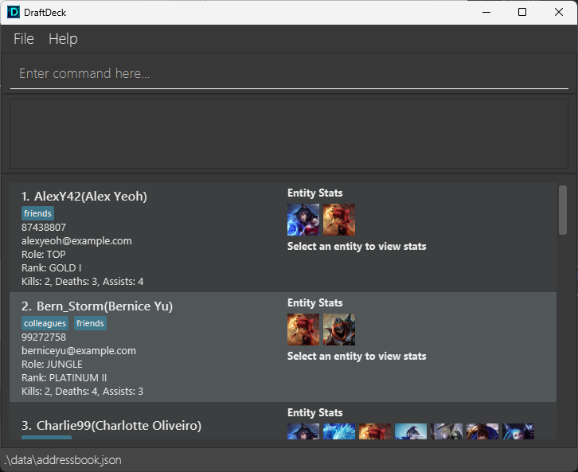
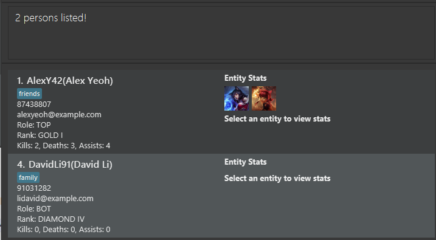
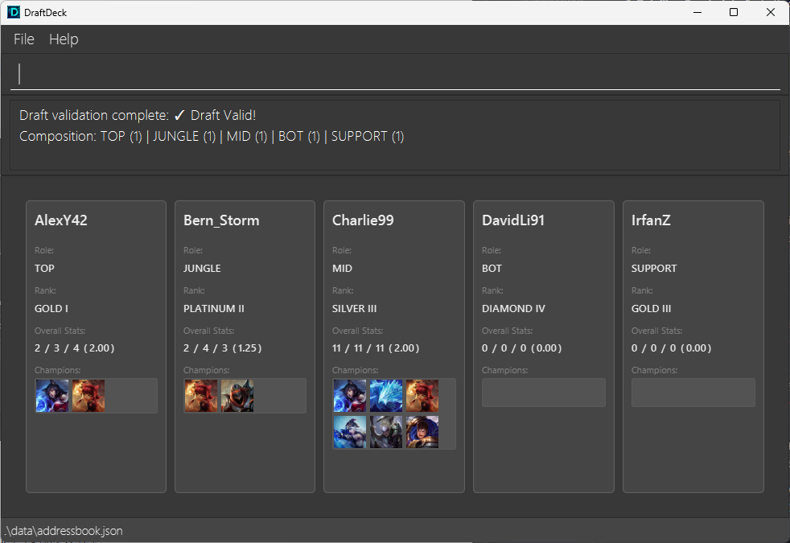

DraftDeck is a **desktop app for managing gaming teams and players, optimized for use via a Command Line Interface** (CLI) while still having the benefits of a Graphical User Interface (GUI). If you can type fast, DraftDeck can get your team management tasks done faster than traditional GUI apps.

* Table of Contents
{:toc}

--------------------------------------------------------------------------------------------------------------------

## Quick start

1. Ensure you have Java `17` or above installed in your Computer. 
   **Mac users:** Ensure you have the precise JDK version prescribed [here](https://se-education.org/guides/tutorials/javaInstallationMac.html).

1. Download the latest `.jar` file from [here](https://github.com/AY2526S2-CS2103T-W09-2/tp/releases). Optionally, also download the images.

1. Copy the file to the folder you want to use as the _home folder_ for your DraftDeck.

:bulb: **Tip:**
If you wish to use images, place the downloaded images folder here as well!

1. Open a command terminal, `cd` into the folder you put the jar file in, and use the `java -jar draftdeck.jar` command to run the application. 
   A GUI similar to the below should appear in a few seconds. Note how the app contains some sample data. 
   

1. Type the command in the command box and press Enter to execute it. e.g. typing **`help`** and pressing Enter will open the help window. 
   Some example commands you can try:

   * `list` : Lists all players.

   * `add n/John Doe p/98765432 e/johnd@example.com i/JohnD88 r/MID rank/GOLD I` : Adds a player named `John Doe` to the player list.

   * `delete 3` : Deletes the 3rd indexed player.

   * `clear` : Deletes all players.

   * `exit` : Exits the app.

1. Refer to the [Features](#features) below for details of each command.

:bulb: **Tip:**
First time using this app? Consider going through the [walkthrough](#walkthrough-setting-up-the-national-esports-team) first to get a feel for things!

--------------------------------------------------------------------------------------------------------------------

## Features

**:information_source: Notes about the command format:** 

* Words in `UPPER_CASE` are the parameters to be supplied by the user. 
  e.g. in `add n/NAME`, `NAME` is a parameter which can be used as `add n/John Doe`.

* Items in square brackets are optional. 
  e.g `n/NAME [t/TAG]` can be used as `n/John Doe t/friend` or as `n/John Doe`.

* Items in round brackets are required, but are in an either|or format. 
  e.g `(INDEX | i/IGN)` can be `1` or `i/Player1`.

* Items with `…`​ after them can be used multiple times including zero times. 
  e.g. `[t/TAG]…​` can be used as ` ` (i.e. 0 times), `t/friend`, `t/friend t/family` etc.

* Parameters can be in any order. 
  e.g. if the command specifies `n/NAME p/PHONE_NUMBER`, `p/PHONE_NUMBER n/NAME` is also acceptable.

* Extraneous parameters for commands that do not take in parameters (such as `help`, `list`, `exit` and `clear`) will be ignored. 
  e.g. if the command specifies `help 123`, it will be interpreted as `help`.

* If you are using a PDF version of this document, be careful when copying and pasting commands that span multiple lines as space characters surrounding line-breaks may be omitted when copied over to the application.

### Core Commands

#### Viewing help : `help`

Shows a message explaining how to access the help page.

Format: `help`

#### Clearing all entries : `clear`

Clears all entries from the player list.

Format: `clear`

#### Exiting the program : `exit`

Exits the program.

Format: `exit`

### Player management

#### Adding a person: `add`

Adds a player to the player list.

Format: `add n/NAME p/PHONE e/EMAIL i/IGN r/ROLE rank/RANK [t/TAG]…​`

:bulb: **Tip:**
A player can have any number of tags (including 0)

Examples:
* `add n/John Doe p/98765432 e/johnd@example.com i/JohnD88 r/MID rank/GOLD`
* `add n/Betsy Crowe t/friend e/betsycrowe@example.com i/Betsycrowe r/BOT rank/PLATINUM p/1234567`

#### Deleting a person : `delete`

Deletes the specified person from the player list.

Format: `delete INDEX`

* Deletes the person at the specified `INDEX`.
* The index refers to the index number shown in the displayed person list.
* The index **must be a positive integer** 1, 2, 3, …​

#### Editing a person : `edit`

Edits an existing person in the player list.

Format: `edit INDEX [n/NAME] [p/PHONE] [e/EMAIL] [addr/ADDRESS] [i/IGN] [r/ROLE] [rank/RANK] [t/TAG]…​`

* Edits the person at the specified `INDEX`. The index refers to the index number shown in the displayed person list. The index **must be a positive integer** 1, 2, 3, …​
* At least one of the optional fields must be provided.
* Existing values will be updated to the input values.
* When editing tags, the existing tags of the person will be removed i.e adding of tags is not cumulative.
* You can remove all the person's tags by typing `t/` without
    specifying any tags after it.

Examples:
*  `edit 1 p/91234567 e/johndoe@example.com` Edits the phone number and email address of the 1st person to be `91234567` and `johndoe@example.com` respectively.
*  `edit 2 n/Betsy Crower t/` Edits the name of the 2nd person to be `Betsy Crower` and clears all existing tags.
*  `edit 3 r/JUNGLE rank/DIAMOND I` Edits the role and rank of the 3rd person.

#### Listing all persons : `list`

Shows a list of all persons in the player list.

Format: `list`

### Search and Discovery

#### Locating persons by name: `find`

Finds persons whose names contain any of the given keywords.

Format: `find KEYWORD [MORE_KEYWORDS]`

* The search is case-insensitive. e.g `hans` will match `Hans`
* The order of the keywords does not matter. e.g. `Hans Bo` will match `Bo Hans`
* Only the name is searched.
* Only full words will be matched e.g. `Han` will not match `Hans`
* Persons matching at least one keyword will be returned (i.e. `OR` search).
  e.g. `Hans Bo` will return `Hans Gruber`, `Bo Yang`

Examples:
* `find John` returns `john` and `John Doe`
* `find alex david` returns `Alex Yeoh`, `David Li` 
  

#### Filtering persons : `filter`

Finds persons whose tags, roles, or entities contain any of the given keywords.

Format: `filter [t/KEYWORD [MORE_KEYWORDS]...] [r/KEYWORD [MORE_KEYWORDS]...] [ent/KEYWORD [MORE_KEYWORDS]...]`

* The search is case-insensitive. e.g `friend` will match `friend`, `Friend`, or `FRIEND`
* You can filter by tags (`t/`), roles (`r/`), entities (`ent/`), or any combination of these.
* Within each category (tags, roles, entities), persons matching at least one keyword will be returned (i.e. `OR` search).
* Multiple categories are combined with `AND` logic - a person must match at least one keyword from each specified category.
* Only full words will be matched e.g. `friend` will not match `friends`

Examples:
* `filter t/friend` Returns people tagged with `friend`
* `filter r/top r/jungle` Returns people with role `TOP` or `JUNGLE`
* `filter ent/Ahri ent/Yasuo` Returns people who have statistics for entity `Ahri` or `Yasuo`
* `filter t/pro r/bot ent/Jinx` Returns people who are tagged `pro`, have role `BOT`, AND have statistics for entity `Jinx`

### Sports and Analytics

#### Comparing players : `compare`

Compares two players identified by their index numbers.

Format: `compare (INDEX1 | i/IGN1) (INDEX2 | i/IGN2)`

* Displays details of both players side by side.
* The indices refer to the index numbers shown in the displayed person list.
* Indices **must be positive integers** 1, 2, 3, …​
* The two players must be different.

Example:
* `compare 1 2` Compares the 1st and 2nd indexed players in the current list.
* `compare i/AlexY42 2` Compares the player with the IGN AlexY42 and the 2nd indexed player in the current list.

#### Drafting a team : `draft`

Tests if a specific team composition is valid.

Format: `draft (INDEX | i/IGN) [(INDEX | i/IGN)]…​`

* Selects 5 players by their index numbers or in-game names (IGN).
* A valid team requires exactly 5 players with one player per role (TOP, JUNGLE, MID, BOT, SUPPORT).
* You can mix indices and IGNs in the same command.

Examples:
* `draft 1 2 3 4 5` Drafts players at indices 1-5.
* `draft i/PlayerA i/PlayerB i/PlayerC i/PlayerD i/PlayerE` Drafts players by their IGNs.
* `draft 1 2 i/CarlK77 4 i/ElleM55` Mixes indices and IGNs.

Example output:

#### Updating player statistics : `stats`

Updates the statistics of a player for a specific entity.

Format: `stats (INDEX | i/IGN) ent/ENTITY [k/KILLS] [d/DEATHS] [a/ASSISTS]`

* Updates the person at the specified `INDEX`, or with the specified IGN. The index refers to the index number shown in the displayed person list. The index **must be a positive integer** 1, 2, 3, …​
* `ent/ENTITY` is required and specifies which champion the statistics are for.
* At least one of the statistics fields (kills, deaths, assists) must be provided.
* Existing statistics for the entity will be added to the new values.
* Statistics for entities are added to the player's total statistics.

Examples:
* `stats 1 ent/Ahri k/50 d/10 a/20` Adds 50 kills, 10 deaths, and 20 assists to player 1's Ahri statistics.
* `stats 2 ent/Leona k/0 d/5 a/15` Adds 0 kills, 5 deaths, and 15 assists to player 2's Leona statistics.

#### Adding match results : `result`

Adds a match result to the match record.

Format: `result w/RESULT [date/yyyy-MM-dd] i/IGN ent/ENTITY s/KILLS-DEATHS-ASSISTS`

* All players and entities must exist in DraftDeck.
* Also updates the statistics of all players involved in the match.
* `w/RESULT` must be one of: `WIN`, `LOSE`, `DRAW`. Not case-sensitive.
* `date/yyyy-MM-dd` is optional. If not provided, uses the current date.
* There must be exactly 5 of `IGN`, `ENTITY`, `KILLS-DEATHS-ASSISTS`.
* The parameters can be in any order, the i-th occurrence of `ENTITY`, `KILLS-DEATHS-ASSISTS` will be
  mapped to the player with the i-th `IGN`.

Example:
* `result w/WIN i/PlayerA ent/Ahri s/10-2-8 i/PlayerB ent/Leona s/1-1-12 i/PlayerC ent/Evelynn s/5-6-15
i/PlayerD ent/Irelia s/2-19-4 i/PlayerE ent/Kayn s/6-3-8` Records a win today where
  * PlayerA played Ahri, killed 10 times, died 2 times and assisted 8 times.
  * PlayerB played Leona, killed 1 time, died 1 time and assisted 12 times.
  * PlayerC played Evelynn, killed 5 times, died 6 times and assisted 15 times.
  * PlayerD played Irelia, killed 2 times, died 19 times and assisted 4 times.
  * PlayerE played Kayn, killed 6 times, died 3 times and assisted 8 times.
* `result W/WIN i/PlayerA i/PlayerB i/PlayerC i/PlayerD i/PlayerE ent/Ahri ent/Leona ent/Evelynn ent/Irelia ent/Kayn
s/10-2-8 s/1-1-12 s/5-6-15 s/2-19-4 s/6-3-8` Records the exact same match as the above command.
* `result w/LOSE i/PlayerA ent/Ahri s/10-2-8 i/PlayerB ent/Leona s/1-1-12 i/PlayerC ent/Evelynn s/5-6-15
i/PlayerD ent/Irelia s/2-19-4 i/PlayerE ent/Kayn s/6-3-8 date/2025-12-31`
Records a loss on that took place on 31st December 2025.

### Saving the data

DraftDeck data are saved in the hard disk automatically after any command that changes the data. There is no need to save manually.

### Editing the data file

DraftDeck data are saved automatically as a JSON file `[JAR file location]/data/addressbook.json`. Advanced users are welcome to update data directly by editing that data file.

:exclamation: **Caution:**
If your changes to the data file makes its format invalid, DraftDeck will discard all data and start with an empty data file at the next run. Hence, it is recommended to take a backup of the file before editing it. 
Furthermore, certain edits can cause the DraftDeck to behave in unexpected ways (e.g., if a value entered is outside of the acceptable range). Therefore, edit the data file only if you are confident that you can update it correctly.

--------------------------------------------------------------------------------------------------------------------

## FAQ

**Q**: How do I transfer my data to another Computer? 
**A**: Install the app in the other computer and overwrite the empty data file it creates with the file that contains the data of your previous DraftDeck home folder.

--------------------------------------------------------------------------------------------------------------------

## Known issues

1. **When using multiple screens**, if you move the application to a secondary screen, and later switch to using only the primary screen, the GUI will open off-screen. The remedy is to delete the `preferences.json` file created by the application before running the application again.
2. **If you minimize the Help Window** and then run the `help` command (or use the `Help` menu, or the keyboard shortcut `F1`) again, the original Help Window will remain minimized, and no new Help Window will appear. The remedy is to manually restore the minimized Help Window.

--------------------------------------------------------------------------------------------------------------------

## Command summary

Action | Format, Examples
--------|------------------
**Add** | `add n/NAME p/PHONE e/EMAIL i/IGN r/ROLE rank/RANK [t/TAG]…​`   e.g., `add n/James Ho p/22224444 e/jamesho@example.com i/JamesH88 r/BOT rank/PLATINUM t/friend t/colleague`
**Clear** | `clear`
**Compare** | `compare INDEX1 INDEX2`  e.g., `compare 1 2`
**Delete** | `delete INDEX`  e.g., `delete 3`
**Draft** | `draft (INDEX | i/IGN) [(INDEX | i/IGN)]…​`  e.g., `draft 1 2 i/CarlK77 4 i/ElleM55`
**Edit** | `edit INDEX [n/NAME] [p/PHONE] [e/EMAIL] [addr/ADDRESS] [i/IGN] [r/ROLE] [rank/RANK] [t/TAG]…​`  e.g.,`edit 2 n/James Lee r/JUNGLE rank/GOLD`
**Find** | `find KEYWORD [MORE_KEYWORDS]`  e.g., `find James Jake`
**Filter** | `filter [t/KEYWORD [MORE_KEYWORDS]...] [r/KEYWORD [MORE_KEYWORDS]...] [ent/KEYWORD [MORE_KEYWORDS]...]`  e.g., `filter t/pro r/bot ent/Jinx`
**List** | `list`
**Result** | `result w/RESULT [date/yyyy-MM-dd] i/IGN ent/ENTITY k/KILLS d/DEATHS a/ASSISTS [(i/IGN ent/ENTITY k/KILLS d/DEATHS a/ASSISTS)]…​`  e.g., `result w/WIN i/PlayerA ent/Ahri k/10 d/2 a/8 i/PlayerB ent/Leona k/1 d/1 a=12`
**Stats** | `stats INDEX ent/ENTITY [k/KILLS] [d/DEATHS] [a/ASSISTS]`  e.g., `stats 1 ent/Ahri k/50 d/10 a/20`
**Help** | `help`

### Glossary

* **IGN**: In-Game Name, a player's username in the game
* **Entity**: An umbrella term for a character that the player plays in the game. In League of Legends, this refers to a 'Champion'. In other games, this may refer to an 'Agent', 'Operator', 'Hero', or whatever term that particular game uses.


